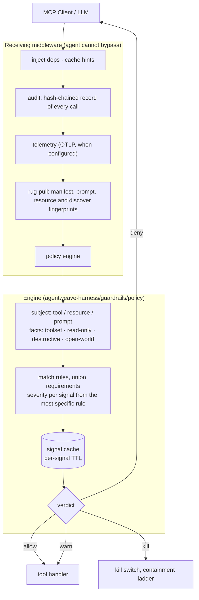
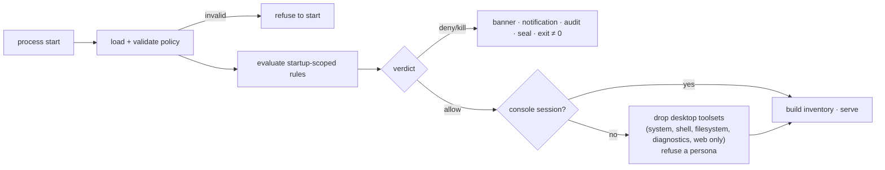
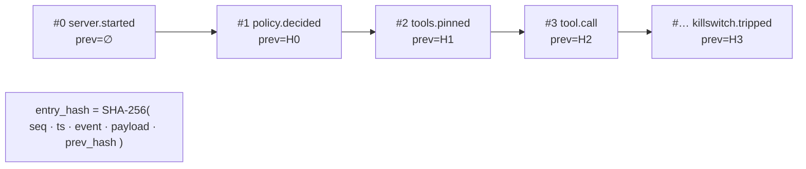
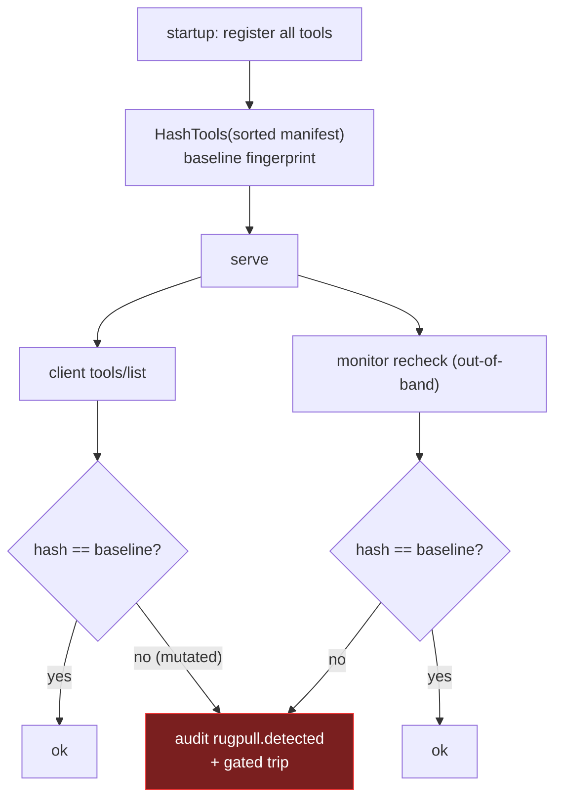
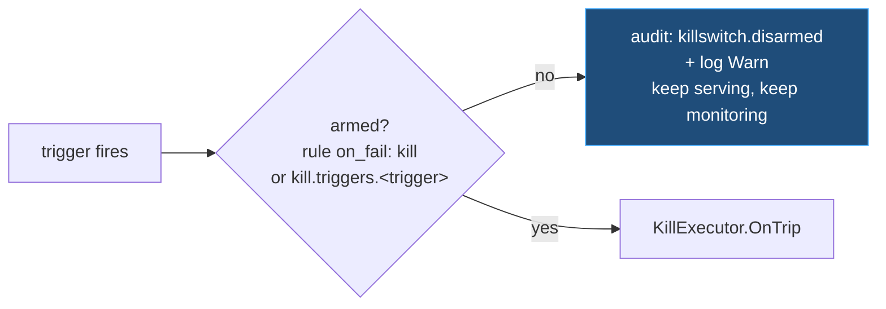
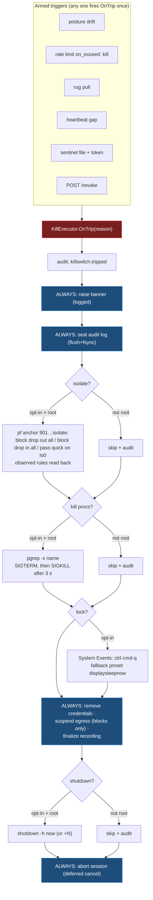
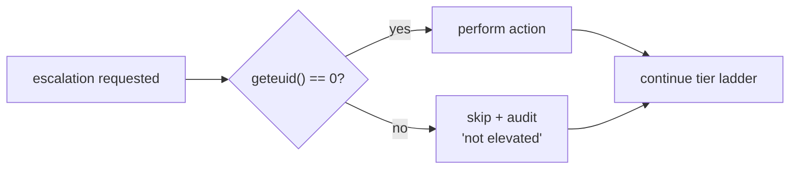
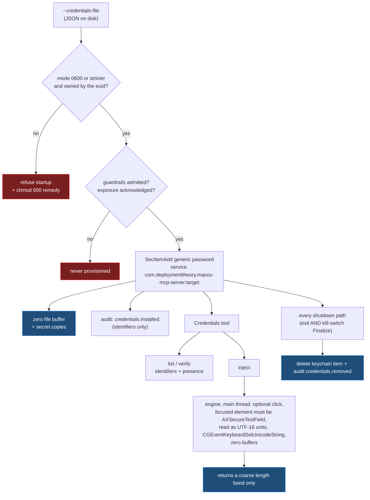

# Security Architecture

`macos-mcp-server` hands a non-deterministic LLM real control over a macOS
desktop: the accessibility tree and synthetic input, a shell, preference
domains, launchd jobs, processes, the filesystem. For managed use it therefore
**gates and contains itself**.

A **policy engine** sits between the MCP caller and the tools. Before a tool
runs, a resource is read or a prompt is fetched, it evaluates live device
signals against rules in a policy document and decides what happens. It runs on
the server's *receiving* path, innermost in the middleware chain, so the agent
can neither bypass nor disable it.

```sh
macos-mcp-server stdio --policy-config "/Library/Application Support/MacOSMCP/policy.json"
```

With no document the built-in default applies: the engine is present, every
declared signal is evaluated and every verdict recorded, and nothing is refused.

> **Scope.** This document describes the design of the *in-process* stack this
> server runs standalone. The guardrails packages it wires come from the
> [agentweave-harness](https://github.com/deploymenttheory/agentweave-harness)
> module, which also documents the process-boundary model (a separate harness
> that governs this server over a control channel, a unix socket on macOS); see
> that repo's `docs/architecture.md`. The wiring order, the planner, the
> evidence operations and the secret-environment handling come from
> `mcp-server-core/runtime`, shared with windows-mcp-server. The document
> schema, signal catalogue, egress, monitoring, evidence and plan-and-apply
> references live in the harness repo (this repo's `docs/policy-config.md`,
> `docs/egress.md` and the other short pages point there and add the macOS
> reading). What stays here is the host-side residue that cannot move:
> credentials (use-without-disclosure, in the login keychain), the main thread,
> the OS probes and actuators (TCC, pf, System Events, `shutdown(8)`), and the
> stdio-only posture. For a quick start, the
> [Guardrails section of the README](../README.md#guardrails). The local
> signals are **auditable defense-in-depth, not a hard boundary**; see
> [Trust model](#trust-model).

---

## The decision path



The chain is installed in **one** `Surface.InstallReceiving` call, built by
`runtime.ReceivingChain`, so the order drawn is the order that runs; separate
calls would reverse it, because the SDK wraps each call around the chain so far.
Under an enforcing harness the chain collapses to audit alone and the harness
owns the rest.

Every verdict is written to the audit chain first, including allows, and
including in audit mode, so the record exists before anything acts on it.

---

## Verdicts

A rule states what happens when a signal it requires fails. The verdict for a
request is the **highest** severity among its failures, then capped by the
policy's mode.

| `on_fail` | | Effect |
|---|---|---|
| `allow` | green | Proceeds. The failure is still recorded. |
| `warn` | amber | Proceeds, and the warning is attached to the result, so the model sees it and not only the operator. |
| `hold` | held | The call is suspended on an out-of-band human decision solicited over a webhook; it proceeds only if approved, and a timeout denies. Dual control; see the harness's `docs/policy-config.md`. |
| `deny` | red | This call is refused. Nothing latches: the next call is evaluated afresh, so a signal that recovers restores service without a restart. |
| `kill` | out of bounds | The kill switch trips and the containment ladder runs. |

`mode: "audit"` caps severity at `warn`. It **caps rather than skips**: signals
are still read and every verdict is still recorded, including the `intended`
severity enforcing would have applied. That record is the whole value of audit
mode; it is how an operator sees what a policy would refuse before switching it
on. It is also the shipped default, so adopting the engine cannot break a
working deployment before its policy is written.

A refusal takes the shape the method requires. `tools/call` gets an `IsError`
result with a nil Go error, so the model can read the reason and adapt.
`resources/read` and `prompts/get` have no `IsError` envelope (their results are
`ReadResourceResult` and `GetPromptResult`), so a refusal there is a JSON-RPC
error. Answering either with a `CallToolResult` would put the wrong shape on
the wire.

---

## Rules

Rules match on what a call can actually do, so posture requirements scale with
risk rather than applying uniformly:

- `tool`, by name.
- `toolset`, by id; `"*"` matches every tool.
- `annotation`: `read-only`, `destructive`, `open-world`, from the tool's MCP
  annotations.
- `scope`: `call` (default) or `startup`.

Selectors within one match are ANDed; values within a selector are ORed.

**Requirements are the union** across every matching rule, so adding a rule can
never drop a requirement another imposed. **Severity is attributed per signal**
to the most specific rule that requires it:

```
tool  >  annotation  >  named toolset  >  toolset "*"
```

Ties break by document order, last wins. `policy explain --tool <name>` prints
exactly this attribution, evaluating nothing, so a refusal in the field is
attributable without re-running device probes, and from a different machine.

`resources/read` and `prompts/get` are decided as read-only subjects with no
toolset. A resource exposing the same desktop state as a tool must not be a way
around the rule covering that tool.

Tool names, toolset ids and persona ids are identical to windows-mcp-server's
except for four tools renamed because the Windows name denotes a Windows
subsystem (`Registry` to `Defaults`, `PowerShell` to `Shell`, `ScheduledTask`
to `LaunchdJob`, `EventLog` to `UnifiedLog`), so a policy document means the
same thing on both platforms. `TestToolNamesMatchTheWindowsServer` and
`TestToolsetIDsMatchTheWindowsServer` pin it.

---

## Startup admission

Rules scoped `startup` are evaluated once, before any tool surface is
assembled. A refused device never gets as far as registering tools or
provisioning credentials.



A named policy that fails to load is fatal. Falling back to the default would
silently run a device under weaker policy than its operator wrote.

Two macOS-specific checks sit beside admission. The process must have a
graphical login session to drive a desktop; without one (a LaunchDaemon, an ssh
login) the automation toolsets are dropped regardless of what was asked for,
detected through `CGSessionCopyCurrentDictionary` rather than declared, and a
persona is refused outright because it is a desktop-automation preset. And
`--tools` cannot widen a persona: a tool outside the persona's toolsets is a
configuration error (`tools.persona_bypass.denied`), because a persona is a
documented surface guarantee.

---

## Signal freshness

Device probes are expensive: `profiles`, `csrutil`, `fdesetup`, `bputil`,
`app-sso`, `spctl` and `dsconfigad` are each a child process costing tens to
hundreds of milliseconds, and a desktop-automation session makes many small
tool calls. Evaluating every signal per request would dominate the session.

Each signal carries a `ttl`. Readings are cached, and the in-flight monitor
refreshes expired ones in the background so staleness is bounded by
`inflight.interval` as well as by the TTL itself. `"ttl": "0s"` opts a signal
into live evaluation on every request, which is correct for cheap in-process
signals such as `run-context` (a `geteuid` and a window-server call) and
expensive on anything backed by a CLI. A fresh probe object is created per
evaluation so posture re-checks see current state; within one evaluation the
facts are read once.

Two properties matter:

- **The cache starts unread, not passing.** A cache that began life holding a
  pass would admit the first calls of a session without having looked at the
  device.
- **A failing signal is not a monitor error.** `signalCache.Refresh` runs as a
  monitor `VerifyFunc`, and a `VerifyFunc` returning an error fires that
  check's kill trigger. Reporting a failing signal that way would escalate
  every failure to containment regardless of the severity its policy assigned.

Posture drift falls out of the same mechanism: a signal that flips to failing
is picked up by whichever rules require it, on the next call and by the
monitor's own re-evaluation of the startup rules.

### The posture probes are a mapping

The harness's `HealthProbe` and `SystemProbe` interfaces are Windows-shaped.
`internal/macmcp/healthprobe_darwin.go` and `systemprobe.go` answer each
Windows question with the closest native fact. The full table is in
[policy-config.md](policy-config.md); the properties that matter for a reader
of a verdict are these:

| Signal | macOS reading | Caveat an auditor needs |
|---|---|---|
| `secure-boot` | Apple silicon boot security at Full Security via `bputil -d`, refined over `csrutil status` | `bputil` needs root. Unelevated, the reading collapses to SIP status, the same fact `vbs` reports |
| `tpm-present` | Secure Enclave: every Apple silicon Mac, T2 Intel Macs via `system_profiler` | Presence only; never attestation-capable |
| `tpm-attested` | always errors | There is no platform attestation service to quote against. The signal fails at the rule's severity, never passes |
| `vbs` / `hvci` / `credential-guard` | SIP (`csrutil status`), sealed system volume (`csrutil authenticated-root status`), Gatekeeper (`spctl --status`) | A failed `authenticated-root` or `spctl` read reports false, not an error |
| `bitlocker` | FileVault via `fdesetup status` | One entry, the boot volume; secondary APFS volumes are not read |
| `run-context` | a console (graphical) login session; elevated means euid 0; "system" means root with no console session | the macOS analogue of Windows Session 0 |
| `not-admin` | not a member of group `admin` (gid 80) | root is in `admin`, so an elevated server fails it. A group lookup error reports not-admin |
| `mdm-enrolled`, `entra-joined` | `profiles status -type enrollment`; Platform SSO via `app-sso platform -s` | answered through a **command table** that renders the `dsregcmd /status` text the harness's parser expects; no other command passes that seam and no shell is involved |

Every probe is argv-only through `internal/clirunner`, bounded by a timeout,
and a missing or refusing tool reports an error for that signal, never a
fabricated pass.

---

## Always-on transparency

These services are configured by the policy's `transparency` block and are
**never exposed as tools**, so a "bout of madness" cannot switch them off.

### Hash-chained audit log

Every action and security event is an append-only entry that commits to the
previous entry's hash. Any edit, insertion, deletion, or reorder breaks the
chain and is caught by `VerifyChain`. Tool calls record the tool name and a
**SHA-256 digest of the arguments**, never the raw arguments, which may carry
secrets.



`transparency.audit_destination` selects the destination: empty or `stderr`
writes `AUDIT {json}` lines to stderr (stdout is reserved for the MCP
transport); a path writes append-only JSONL, fsync-ed on flush, so the chain
survives an abrupt kill; a directory adds a cross-session manifest. The chain
is keyed (HMAC) only with a file or directory destination, from
`MACOS_MCP_AUDIT_KEY` or a key generated beside the log on first use.

### Off-box anchoring

`transparency.anchor.destination: "eventlog"` (the only name the shared schema
accepts) publishes each chain head to the **unified log** through `logger(1)`
under the `macos-mcp-server` tag, at `transparency.anchor.cadence`, and only
when the head has advanced. The entry is then owned by the system log store
rather than by this process. Anchoring never gates startup: if `logger` is
unavailable the server anchors to the chain only and warns.

### Heartbeat

Periodic chained entries (`transparency.heartbeat`) prove liveness. An external
watcher polling the status snapshot, or the in-process watchdog (three missed
intervals) independent of the monitor loop, detects a gap and can trigger a
kill.

### Rug-pull detection

A "rug pull" is an approved server mutating its advertised tools after
deployment, adding, removing or renaming tools, or silently changing
descriptions or schemas, to smuggle unauthorized behavior past the initial
approval.

Four surfaces are fingerprinted, not one: **tools**, **prompts**, **resources**
and the **`server/discover` advertisement**. A mutated prompt changes the
instructions the model follows, and a mutated resource URI changes what it
reads, so both are rug-pull vectors as much as a mutated tool; `server/discover`
is the canonical statement of capabilities and instructions under 2026-07-28,
so a change there is a change to what the server claims to be. Each is pinned
separately (`SetBaseline`, `SetPromptBaseline`, `SetResourceBaseline`,
`SetDiscoverBaseline`) and a surface with no baseline is skipped rather than
treated as drift, so a server that serves no prompts cannot trip on them.

Capabilities are pinned explicitly with `listChanged` false. This matters: the
SDK *infers* prompt and resource capabilities with `listChanged: true` the
moment one is registered, which would let a mutated manifest be pushed to the
client without it re-listing, the exact channel this detection exists to close.



Under an enforcing harness the whole block (the `GuardrailStatus` and `Kill`
tools and every baseline) is shed: the harness injects its own tools and
fingerprints every surface from the wire, where a tampered server cannot vouch
for itself.

### Security banner

A kill-switch trip and a refused startup both raise the security banner. In
this build `ShowSecurityBanner` records the text (readable through the status
surface) and writes a `SECURITY BANNER` warning to the log; it does not yet
draw on screen, so the banner is **not** on the session recording. The refused
startup additionally raises a user notification. The overlay manager that will
draw it is started when `transparency.banner` is true, so the hook is in place
for the pixels to land; until they do, treat the banner as a log event.

---

## Kill switch: tiered, out-of-band

Triggers are configured **separately** from actions.

### Arming

Two things arm the switch, both stated in the policy document.

**A rule's `on_fail: "kill"`** (or a rate limit's `on_exceed: "kill"`). Writing
that *is* the operator arming containment for that case, so it needs no second
switch. Requiring one elsewhere in the file would mean a policy that reads as
arming the kill switch quietly does not. `mode: "audit"` still caps it to a
warning, so the default can never reach here.

**The `kill.triggers` block**, for the sources that have no rule severity of
their own: `posture_drift`, `rugpull`, `heartbeat_gap`, `sentinel`. Each
defaults off.

**Detection is never gated.** A trigger that fires while its switch is off is
still detected, logged at Warn, and written to the audit chain as
`killswitch.disarmed` with the trigger and reason. Transparency does not depend
on containment: the operator always sees that something fired, even when they
chose not to act on it. Critically, a report-only trip does **not** end the
in-flight monitor loop; disabling one trigger must not silently disable all
subsequent monitoring (`MonitorConfig.Stopped` gates loop exit, and only a real
trip sets it).



### The ladder

Once armed, every trip **always** raises the banner, seals the audit log,
removes the session's credentials, finalizes the recording, and aborts the
session. The order is deliberate: seal and finalize the forensic trail
**before** any shutdown. The actuators are macOS's (`internal/macguard`):



Three macOS details in that picture:

- **Isolation is its own pf anchor**, `com.apple/901.deploymenttheory.macosmcp.isolate`,
  separate from the egress anchor, with the recovery state written before the
  rules are loaded so a crash mid-containment is cleaned up by the next start.
  What is recorded in `killaction.done{isolate}` is what `pfctl -sr` read back,
  so "isolate ran" and "isolate took effect" are separate claims.
- **Process kill matches the whole process name** (`pgrep -x`, with a trailing
  `.app` stripped) and only signals what the process may signal.
- **Lock needs no root but does need consent.** The Lock Screen shortcut is
  sent through System Events, which requires the server's Accessibility grant
  and an Automation (Apple Events) consent for System Events; the fallback,
  display sleep, locks only when the screen saver requires a password.

**Nothing is armed by default.** The shipped default policy sets every
`kill.actions` field to false, so a trip raises the banner, seals the audit
log, finalizes the recording and aborts the session, and contains nothing.
Each action is opt-in per document. When `isolate` is armed, network isolation
is undone on exit (the executor keeps a `restore` handle), and the egress
anchor is **suspended** rather than restored in `Finalize`: it is reloaded with
its block rules only, so neither the proxy owner nor the exempted daemons keep
a route out during containment.

### The agent-facing `Kill` tool is not an authoritative trigger

`Kill` is deliberately absent from the ladder above. It always stops the
session cleanly (`KillExecutor.StopGracefully`: audit `session.stopped`, seal
the chain, finalize the recording, abort) but it actuates the containment
ladder only when `isolate`, `lock` or `shutdown` is armed in the document.
Containment exists to contain *the agent*, triggered by the authoritative
detectors; letting the agent self-trigger network isolation or a shutdown would
be a denial-of-service vector, not a protection. The sentinel file carries a
per-session token minted at startup and written only to the log and the chain,
for the same reason: a file the agent can write must not be a trigger.

### Privilege model: best-effort degrade

Elevation on macOS means **root** (effective uid 0); there is no partial grant.
The elevation-only actions (isolate / kill-procs / shutdown) run only when the
process is actually root; otherwise they are **skipped and audited**
(`killaction.skipped … not elevated`) while the banner, log-seal,
credential removal, recording-finalize, and abort still happen.



Root is also what the egress tiers need, and running as root has two
consequences the Windows design does not have. The server's own tools and every
child they spawn run as root too, so they share root's exemption from the pf
rules (see [Egress](#egress-pf-not-a-firewall-api)). And root is a member of
`admin`, so a policy that requires `not-admin` on every call cannot be satisfied
by the same process that arms isolation; `locked-down.json` does both and must
be run unelevated or edited. A root process still needs a console session to
drive a desktop, which in practice means it is launched from inside the
logged-in user's session.

---

## Egress: pf, not a firewall API

The proxy, the allowlist matcher and the tier semantics are the harness's; the
OS enforcer is `internal/macguard/pf.go`, documented in [egress.md](egress.md).
What an architecture reader needs:

- Rules load into a sub-anchor, `com.apple/900.deploymenttheory.macosmcp`,
  under Apple's `com.apple/*` anchor point that `/etc/pf.conf` already
  evaluates, so the system ruleset is never edited. The rendered set is written
  to `/Library/Application Support/MacOSMCP/pf-anchor.conf` and loaded with
  `pfctl -a <anchor> -f`; pf is enabled with a reference token (`pfctl -E`)
  that only this run releases.
- The recovery state, `egress-state.json`, is written **before** the first
  `pfctl` call and read on **every** start, even with egress off, so a session
  killed mid-run cannot leave the console user blocked.
- pf uses last-match semantics, so the block is rendered first and the `quick`
  passes after it; `Suspend` keeps only the block rules.
- **pf matches the socket owner, not the executable.** The `scoped` tier is
  therefore **uid-scoped**: it blocks the console user's outbound traffic except
  loopback, which is wider than the Windows per-application tier, and a process
  under another uid is not covered. The `global` tier is `block drop out all`
  plus loopback, DHCP, DNS via `_mdnsresponder`, NTP via `_timed`, and the proxy
  owner's (root) TCP route out bounded to `allow_ports`.
- The system proxy is set through `networksetup` on every enabled network
  service, with the prior values saved in the state file and restored.
- Every tier needs root. Missing elevation is a fatal startup error, never a
  degraded one: an operator whose document says the console user cannot bypass
  the proxy must never get a server where they silently can.

---

## Credentials: use without disclosure

Credentials supplied at init (`--credentials-file`) are installed into the
running user's **login keychain** as generic passwords under the service name
`com.deploymenttheory.macos-mcp-server:<target>`. The threat this design
addresses is **secret disclosure to the model**: an agent that can read a
password can leak it into a transcript, a log, a tool argument, or an outbound
request.



The load-bearing properties:

| Property | How it is enforced |
|---|---|
| The agent can never read a secret | The tool has exactly `list`, `verify` and `inject`; no function in `internal/macdesktop` returns a secret. `readSecretUnits` is unexported, has one caller, and returns UTF-16 code units, not a string. `TestCredentialsToolNeverReturnsSecrets` pins the mode set. |
| Injection lands in a masked field | Immediately before the keystrokes, on the main thread and after any requested click, the focused element's AX role must be `AXSecureTextField`. Every error branch refuses. The per-credential `allow_unmasked_target` opt-out exists for destinations that genuinely cannot report themselves as secure, and declaring it widens the exposure check below. |
| Secrets never reach the audit chain | `credentials.installed` / `credentials.removed` carry name, target, username, class. The tool-call audit middleware hashes arguments, and arguments only ever contain a credential *name*. |
| Secrets never reach argv | Supply is file-only; argv is readable by every user on the machine through `ps`. The `MACOS_MCP_*` environment is withheld from every child process as well. |
| A disclosed file fails closed | Unlike Windows, the Unix bits are the real permission here: the file must be `0600` or stricter and owned by the effective user. A broader mode or another owner refuses startup with the remedy in the message. |
| A readable-back store is refused | The login keychain can be read by the `shell` toolset (`security find-generic-password -w`) and copied by the `filesystem` toolset; serving either beside credentials is refused at startup unless `credentials.acknowledge_toolset_exposure` names it, in which case it is logged and audited. A credential with `allow_unmasked_target` adds `screen`, `interaction` and `system` (Screenshot, GetText, Clipboard) to that list. |
| No residue after a clean session | `persist: session` is the only accepted value, and removal runs on normal exit *and* on kill-switch trip, via one `sync.Once`-guarded cleanup, before the engine is torn down. Durable persistence is rejected, not silently overridden. |
| A blocked startup provisions nothing | Installation happens after startup admission and the exposure check; a partial install is rolled back. |
| Injection is rate-limited | `Credentials` carries `DestructiveHint`, so a rate limit or rule matching that annotation covers it. |

**Residual risk, stated plainly.** The plaintext exists in process memory
between reading the file and `SecItemAdd`. Buffers are zeroed and the JSON
decoder avoids materializing an unwipeable Go string for unescaped values, but
Go's garbage collector offers no guarantee that no copy was made. A host that
can read this process's memory can read the secrets, as it could read them from
the keychain anyway. Two things are macOS-specific. `persist: session` is this
server's promise, not the keychain's: a session that dies without running its
exit path (SIGKILL, a power cut) leaves the item in the login keychain until the
next clean run removes it, and there is no startup recovery pass for
credentials as there is for pf rules. And the keychain's own consent dialog is
not a boundary against this agent: it drives the desktop, so it can click
"Always Allow", which is why the exposure rule treats a served `shell` as
disclosure rather than relying on the prompt. This raises the cost of casual
disclosure; it is not a defence against a compromised host.

---

## Threat model mapping

This table maps each threat to the mechanism that addresses it, organised by
threat. The same ground organised by **actor** (a prompt-injected agent, a
malicious client, a local user, a local admin, a network attacker) is in
[deployment-decision.md](deployment-decision.md).

**Read the coverage column.** It is not decoration. Most mechanisms here are
conditional on something an operator has to do (arm a trigger, choose a
destination, write a rule) and a table that stated only the mechanism would let
"detected and contained when you have configured it" read as "detected and
contained". Every entry says plainly what is unconditional, what depends on
configuration, and what is not covered at all.

| Threat | Mechanism | Coverage |
|---|---|---|
| **Dynamic rug pull**: approved server mutates its tool set post-deploy | Manifest fingerprint pinned at startup + `tools/list` interception + monitor recheck; silent `list_changed` suppressed; audited always, and banner + isolate + abort when armed | **Detection unconditional. Containment on `kill.triggers.rugpull`**, off by default. A surface with no pinned baseline is skipped rather than treated as drift |
| **Indirect prompt injection / data-exfil loops** | A `rate_limits` entry refuses the call once the window is exceeded and, at `on_exceed: "kill"`, escalates to **network isolation** (a pf anchor dropping everything but loopback) then abort, when armed; audit records the call sequence with arg digests either way. Where the exfil target is a domain, the egress allowlist refuses it outright | **Conditional on the rules you write.** Rate limits and the allowlist are both opt-in; the shipped default has neither. Benign-annotated calls composing into a harmful outcome are not covered by either; see the residual-risk list in the deployment decision |
| **Out-of-band control / agent tampering** | Status, audit, heartbeat, monitor, and kill switch are constructed in the server, not exposed as tools; middleware runs on the receiving path, unbypassable. The only agent-facing tools are read-only `GuardrailStatus` and `Kill`, which stops the session but cannot actuate containment unarmed. The sentinel carries a per-session token the agent cannot know | **Unconditional.** One caveat to configure around: the status endpoint's credential belongs in `status_token_env`, not inline in `status_token`; the policy document is agent-readable through the `filesystem` toolset, and `shell` reaches it with no protected-path check at all |
| **High-risk action needs a human, not just a machine verdict** | A rule at `on_fail: "hold"` suspends the call on an out-of-band authoriser (an outbound webhook; no inbound listener, so the stdio-only posture holds), forwarding a digest of the call and never the raw arguments, signed with `MACOS_MCP_APPROVAL_KEY`. Fails closed: a timeout, an unreachable webhook or an unintelligible reply all deny. A plan step hitting the rule blocks the same way at apply time, and a plan containing a `require_plan` tool is put to the same authoriser as a whole before any step runs | **Conditional on an `approvals` webhook and an `on_fail: "hold"` rule**, neither of which the default has. A `hold` rule without a webhook is refused at load, so the control cannot be half-configured. Capped to `warn` in audit mode |
| **Silent posture drift** (FileVault turned off, SIP disabled after a recovery boot, MDM profile removed mid-session) | In-flight monitor re-evaluates the **startup rules** every interval; audited always, kill on drift when armed | **Requires at least one `scope: "startup"` rule.** Drift is detected by re-evaluating those rules, so a policy with none has nothing to re-evaluate; arming `posture_drift` without one is refused at load. Containment on `kill.triggers.posture_drift`, off by default. Note that `secure-boot` unelevated is the SIP reading, so boot-policy drift is only visible to a root server |
| **Log tampering / gaps** | Hash-chained append-only audit + heartbeat. `VerifyChain` detects an edit, insertion, deletion or reorder. When the chain is keyed, each entry carries an HMAC and the session manifest that pins each head is MAC'd under the same key, so a record cannot be rewritten without it. With `anchor.destination: "eventlog"` the head is also published to the unified log at a cadence | **Keyed only with a file or directory `audit_destination`**; a key is then generated on first use beside the log, or supplied as `MACOS_MCP_AUDIT_KEY`. **The shipped default writes to `stderr`, where there is no file to protect and nowhere to keep a key, so the default chain is unkeyed**: tamper-*evident* against accident and process death, not tamper-*proof* against someone who can rewrite the file and recompute the hashes. Anchoring is off by default and the unified log is readable by an admin, so it raises the bar rather than removing it |
| **Credential disclosure to the model** | The `Credentials` tool has no read mode and no engine function returns a secret; `inject` types it and reports only a coarse length band, never a count. Secrets never reach argv, tool results, or the audit chain. `Credentials` carries `DestructiveHint`, so rules and rate limits matching that annotation cover injection. Serving `shell` or `filesystem` beside credentials is refused unless acknowledged | **Holds at the tool boundary.** Around it: injection requires an AX-confirmed `AXSecureTextField`, but nothing stops a later `Click` on a "show password" control followed by `Screenshot` or `GetText`; `allow_unmasked_target` is an operator opt-out that removes the masked-field requirement for one credential; the keychain consent prompt is clickable by the agent; and a crashed session leaves the item in the keychain until the next clean exit. Plaintext in process memory is documented residual risk, not a vulnerability |
| **Data exposure over plaintext HTTP** | `"enforce_https": true` refuses `http://` for `Scrape`, for a URL-shaped `App` launch that would open the browser, and for the may-run endpoint. Scheme matching is case-insensitive. Does **not** intercept navigation inside an already-open browser; the egress proxy is what covers that | **Off by default** (`enforce_https: false`). Covers the three entry points named; navigation inside an already-open browser is not one of them |
| **Evidence destroyed on the device it was gathered on** (wiped disk, reimaged VM, on-box adversary deleting the bundle) | `transparency.export` ships the sealed evidence bundle, plus its manifest and detached signature as separate objects, to cloud blob storage as the session exits. Uploads are **create-only** (`If-None-Match: *`), so an existing record is never overwritten. The destination is dialled through the same address-vetting dialer the proxy uses, so a name answering with loopback, RFC1918 or `169.254.169.254` is refused and `HTTP_PROXY` is ignored. Credentials are the harness's fixed `WINDOWS_MCP_EXPORT_SIGNED_URL*` variables (a documented naming quirk), never flags, never in the document, cleared from the environment at startup and withheld from child processes | **Off by default**, and only `signed_url` is implemented. **Best-effort by design**: a failed upload is logged and recorded, never fatal. **The outcome is not in the audit chain** and cannot be, because the chain is sealed inside the artifact being shipped; `export.configured` records the intent and `session-<stamp>.export.json` the result. **No retry and no spool**: a device offline at exit keeps its only copy. Under `egress` the destination host must be in `egress.allow`, and under `global` the upload leaves through root's `allow_ports` rule |
| **Egress to unapproved destinations** (including navigation inside an already-open browser) | `"egress"` runs a loopback CONNECT/HTTP proxy admitting only the declared domains. The allowlist is checked before the name is resolved, so a refused host emits no DNS query, and resolved addresses are re-checked against loopback/RFC1918/link-local before dialling. `Scrape` is routed through whichever proxy the session runs, so it is bound by the same allowlist. Enforcement tiers: `proxy-only` (advisory), `scoped` (pf blocks the **console user's uid** except loopback, so the proxy is that user's only route out), `global` (machine-wide `block drop out all` with daemon-scoped exceptions for DHCP, DNS, NTP and loopback, so the OS stays functional). Both pf tiers require root and refuse to start without it; state is recorded before any change and recovered on the next start after a crash. **Residual: the server's own uid is the exempt one.** pf cannot match an executable, the server must be root to enforce, and root is the identity the `global` tier passes (to `allow_ports`) and the `scoped` tier never blocks. Every tool that reaches the network directly, and every child it spawns, runs as that uid: `Shell` (`curl`), `LaunchExecutable`, `Package` (`brew`, `softwareupdate`), `Network`'s `test` mode, and `FileSystem` over a network mount under `/Volumes`. All are annotated open-world so a policy rule can gate them; `Package` is in an opt-in toolset no persona carries | **Enforcement is tiered and the tier matters.** `proxy-only` is **advisory**. `scoped` and `global` install pf rules and both require root. Off by default. The tiers bound the **console user's applications** (the browser the agent drives); they do not bound the agent's own shell, which the proxy allowlist constrains only where a tool uses the proxy. A local administrator can undo any of it |

---

## Trust model

The local pre-flight and posture checks (`profiles`, `csrutil`, `fdesetup`,
`bputil`, `spctl`, `app-sso`, group membership) are **auditable
defense-in-depth, not a hard boundary**: a local administrator can spoof those
signals, and a root server reads several of them from CLIs an administrator
can shadow on the rebuilt `PATH`. The containment layers (rate limits, kill
switch, isolation, egress enforcement) raise the cost of, and record,
in-session compromise, but they do **not** replace the OS controls you already
own. Pair this with **MDM-managed configuration profiles**, SIP and the sealed
system volume, Gatekeeper and notarization, Platform SSO with Conditional
Access, and **code signing** of the binary.

Code signing carries more weight here than on Windows. The TCC grants the engine
depends on (Accessibility, Screen Recording) are keyed on the binary's
**signing identity**: an ad-hoc signature's designated requirement is the
binary's hash, so every rebuild re-prompts, and a stable identity (a developer's
self-signed certificate via `make sign-dev`, or Developer ID for releases) is
what lets grants survive. The corollary is that anything signed under the same
identity inherits the grants. There are no entitlements: the file in
`entitlements/` is deliberately an empty dictionary.

The authoritative remote signals, Microsoft Graph device compliance (Entra +
Intune) and an external may-run PDP, register only when their credentials are
present in the environment (`MACOS_MCP_GRAPH_*`, `MACOS_MCP_REMOTE_POLICY_TOKEN`).
They are read from the environment rather than from flags or the policy
document because they are secrets: argv is world-readable and a policy is meant
to be reviewable and checked in. There is no local attestation signal on macOS:
`tpm-attested` always errors.

Registering a signal only makes it available for a policy to declare; nothing
is evaluated unless a policy asks for it.

The transport is stdio only, so a trusted host is assumed by construction and
there is nothing on the network to attack. The loopback HTTP host the official
conformance suite needs exists only behind the `conformance` build tag;
`go build ./...` never compiles it and the workflow asserts that.

---

## Component / file map

| Concern | Package / file |
|---|---|
| Keychain engine (write/delete/present/inject, masked-focus check) | `internal/macdesktop/credentials.go` |
| Credentials init loading + lifecycle | `internal/macmcp/credentials.go` |
| Credentials-file mode and owner check | `internal/macmcp/credfileperm_darwin.go` |
| Credential exposure rule (shell, filesystem, perception) | `internal/macmcp/credexposure.go`, `mcp-server-core/surface/credexposure.go` |
| Credentials tool (list/verify/inject) | `pkg/macos/credentials.go` |
| Policy document: schema, loader, validation, embedded default | `agentweave-harness/guardrails/policy` |
| Signal cache, rule matcher, verdict, rate limits, `Explain` | `agentweave-harness/guardrails/policy` |
| Enforcement middleware (the decision point) and the approval client | `agentweave-harness/guardrails/enforce` |
| Signal registry + the harness's signals | `agentweave-harness/guardrails/signals` |
| macOS system probe (run context, admin, identity, `dsregcmd` command table) | `internal/macmcp/systemprobe.go` |
| macOS health probe (boot security, Secure Enclave, SIP, sealed volume, Gatekeeper, FileVault) | `internal/macmcp/healthprobe_darwin.go` |
| Guardrail env + protected guardrail paths | `internal/macmcp/guardrails.go`, `mcp-server-core/runtime/guardrails.go` |
| Operator commands (`policy validate/check/explain/test`, `audit verify`, `evidence *`) | `cmd/macos-mcp-server/guardrails.go`, `internal/macmcp/policyops.go` |
| Example policies and fixtures | `policy/examples/*.json`, `policy/examples/tests/` |
| Audit log (hash chain, destinations, middleware) | `agentweave-harness/guardrails/audit` |
| Audit anchoring to the unified log | `internal/macmcp/anchor.go` |
| Audit key resolution, secret-environment scrub, status token | `mcp-server-core/runtime/{auditkey,secretenv,statustoken}.go` |
| Evidence bundle (seal, sign, verify) and export | `agentweave-harness/guardrails/{evidence,export}`, `mcp-server-core/runtime/{evidenceops,export}.go` |
| Heartbeat, rug-pull detector, in-flight monitor | `agentweave-harness/guardrails/watch` |
| Kill switch + tiered executor + graceful stop | `agentweave-harness/guardrails/contain` |
| Per-trigger arming gate, sentinel token | `mcp-server-core/runtime/{guardrails,sentinel}.go` |
| macOS actuator (pf isolation, `pgrep`/signals, System Events lock, `shutdown`) | `internal/macguard/actuator.go` |
| pf egress enforcer, rule renderer, recovery state, system proxy | `internal/macguard/{pf,pf_rules,state,sysproxy}.go` |
| Argv-only process runner with the rebuilt environment | `internal/clirunner/clirunner.go` |
| Status surface (tool + HTTP snapshot) | `agentweave-harness/guardrails/status` |
| Egress allowlist matcher and proxy | `agentweave-harness/guardrails/{hostmatch,egress}` |
| Egress provisioning (recovery, tiers, delegated mode) | `internal/macmcp/egress.go`, `mcp-server-core/runtime/egress.go` |
| Enforce HTTPS (URL scheme policy), Scrape through the session proxy | `mcp-server-core/toolkit/scrape.go` |
| Security banner (recorded + logged) | `internal/macdesktop/desktop.go` |
| Permissions (TCC grants, console session, signing identity) | `internal/macmcp/permissions.go` |
| Harness control channel (unix socket) | `internal/macmcp/harnesslink.go`, `mcp-server-core/runtime/harnesslink.go` |
| Wiring (RunStdio, the pinned order) | `internal/macmcp/server.go` |
| CLI entry points, main-thread lock | `cmd/macos-mcp-server/{main,stdio}.go` |

Everything in this repository is `//go:build darwin && (amd64 || arm64)`; the
platform-agnostic core (audit, heartbeat, rug-pull, kill-action logic, the
proxy, the planner) builds and unit-tests on Linux in its own modules, which is
also what lets lint run on a Linux runner with `GOOS=darwin`. The OS-touching
pieces (pf, `networksetup`, signals, System Events, the keychain, the
accessibility tree) live here and are exercised on the macOS runner, with the
live pf suites gated behind `MACOS_MCP_SCOPED_TEST=1` and
`MACOS_MCP_GLOBAL_BLOCK_TEST=1`.
